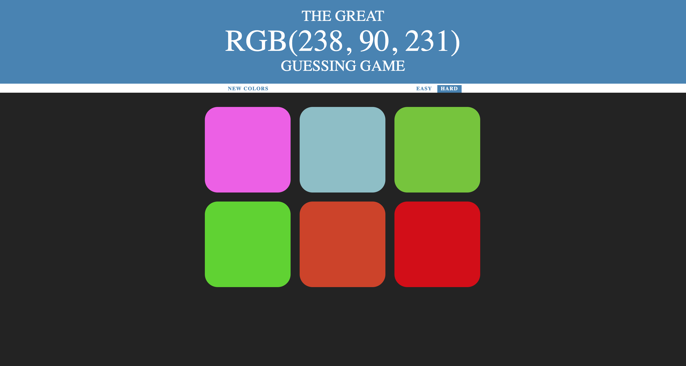

# RGB-Game
An interactive game of colors where a partiuclar string of number is given in RGB format and one has to guess which would be the color for the same out of the given colors.

## Demo
Here is the link for playing the game - https://github.com/SparshKat/RGB-Game

## How to play
1. There is a string given in RGB format *(i.e - RGB(0,255,0) )* , you have to choose the color grid/blocks given below it which could be written in the RGB format. 
1. There are two difficulty modes for this game
   1. Easy
   1. Difficult
1. Easy has three color blocks/grids out of which you have to choose one which matches the given string as question.
1. Hard has six color blocks/grids out of which you have to choose one to win.
1. If a wrong grid is chosen it vanishes upon clicking.
1. If a correct block/grid is chosen, it shows that you were right and all the color blocks turn into the answer of the color.

## This is how the game looks

### Hard difficulty 

